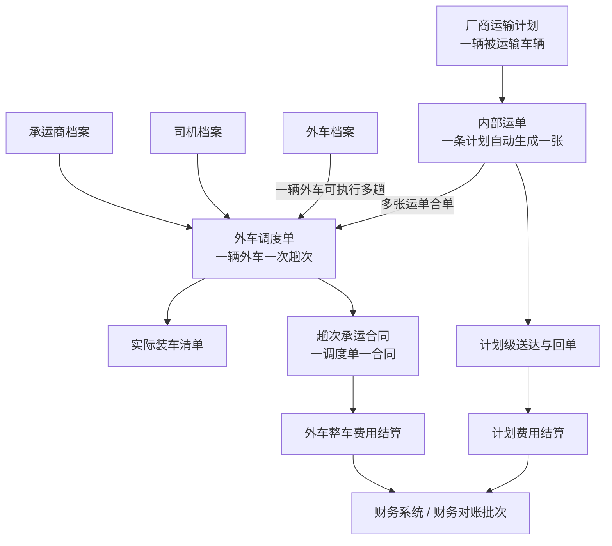
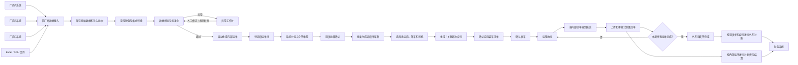

# 多厂商车辆运输调度系统业务需求梳理

版本：V1.0  
日期：2026-08-20  
用途：业务流程确认、产品方案设计、研发范围评估  
说明：本文基于当前沟通信息整理，文中“建议方案”和“待确认事项”需要业务、调度、财务、产品及研发共同确认。

---

## 1. 项目背景

公司承接多个大型厂商的车辆运输任务。厂商每天可能产生数百至上千条运输计划，不同厂商使用不同业务系统，导出的字段名称、格式和数据标准均不一致。

当前主要依靠业务人员完成以下工作：

1. 从不同厂商系统导出运输计划。
2. 人工提取和整理计划中的地址、车辆、联系人、时间等信息。
3. 根据经验将相同或相似路线的计划归整、合单。
4. 联系外部运输车辆，将多辆待运输车辆装入一辆外车。
5. 记录运输完成情况及回单。
6. 分别处理厂商计划费用和外车整车费用。

随着每日计划量增加，逐条整理、逐条建单和人工合单难以持续，容易出现：

- 人工录入工作量大。
- 厂商字段理解不一致。
- 地址和车型格式不统一。
- 实际装车关系与系统做账关系不一致。
- 无法准确追踪每辆被运输车辆。
- 外车合同、调度单和财务对账难以追溯。
- 同一辆外车多趟运输时容易产生排班冲突。
- 计划费用与外车整车费用混淆。

本项目的目标是建设一个统一的运输业务平台，自动完成厂商数据接入、标准化和运单生成，辅助调度人员批量合单和安排外车，并形成真实运输、合同、回单和财务结算闭环。

总结一句话：适配多个厂商系统的运输计划，统一接入后，一条计划生成一张内部运单，多张运单再合并成一张外车调度单，由一辆外部运输车执行，执行完成后分别完成“计划侧结算”和“外车整车侧结算”

---

## 2. 系统定位

系统应定位为：

> 多厂商运输计划接入系统 + 内部运单管理系统 + 外车趟次调度系统 + 双向结算系统。

总体主线：

```text
多厂商数据接入
→ 字段映射和数据标准化
→ 一条计划自动生成一张内部运单
→ 运单进入待调度池
→ 系统推荐合单、调度批量确认
→ 多张内部运单生成一张外车调度单
→ 匹配外车、司机和承运商
→ 一趟生成一份承运合同
→ 确认实际装车
→ 发车、运输、分计划送达
→ 按计划上传和审核回单
→ 外车调度单按合同对账
→ 内部运单按计划费用结算
→ 对接财务系统
```

---

## 3. 核心业务概念

业务中存在两种“车辆”，系统和需求文档必须明确区分：

| 名称 | 定义 |
|---|---|
| 被运输车辆 | 厂商需要公司承运的车辆，一辆被运输车辆对应一条厂商运输计划 |
| 外车 | 公司租用的外部运输车辆，一次可以装载多辆被运输车辆 |

建议统一以下业务对象名称：

| 业务对象 | 定义 |
|---|---|
| 厂商运输计划 | 厂商系统产生的原始运输需求，一辆被运输车辆对应一条计划 |
| 内部运单 | 厂商计划导入并标准化后，由系统自动生成的内部执行单据 |
| 外车档案 | 外部运输车辆的基础资料，一辆外车可以执行多个趟次 |
| 外车调度单 | 一辆外车执行一次运输趟次的业务单据，可包含多张内部运单 |
| 实际装车清单 | 本次趟次中真实装上外车的内部运单和被运输车辆清单 |
| 趟次承运合同 | 针对某一张外车调度单签订的外车运输合同 |
| 计划费用结算 | 按内部运单维度核算的厂商计划费用 |
| 外车费用结算 | 按外车调度单及对应合同核算的整车费用 |
| 财务对账批次 | 将多张计划或外车结算单汇总对账的财务批次，不代表实际运输关系 |

### 3.1 核心关系

```text
一辆被运输车辆
= 一条厂商运输计划
= 一张内部运单

多张内部运单
= 一张外车调度单

一张外车调度单
= 一辆外车的一次运输趟次
= 一份趟次承运合同
= 一笔外车对账明细

一辆外车
= 可以在一天内执行多个趟次
= 可以对应多张外车调度单和多份合同
```

### 3.2 对象关系图



---

## 4. 总体端到端流程



---

## 5. 第一阶段：多厂商数据接入

### 5.1 业务目标

解决不同厂商系统、不同字段和不同文件格式下，业务人员需要人工摘取数据的问题。

### 5.2 接入方式

系统建议支持：

- Excel批量导入。
- 厂商API接口。
- SFTP或固定目录文件交换。
- 定时获取或定时导入。
- 临时手工补单。

MVP建议先支持Excel和API，其他方式根据厂商能力逐步补充。

### 5.3 厂商适配配置

每个厂商维护独立的接入配置，但最终统一转换为内部标准数据模型。

示例：

| 厂商原字段 | 内部标准字段 |
|---|---|
| 计划单号 | 厂商计划编号 |
| VIN / 车架号 | 被运输车辆唯一编号 |
| 提车地址 | 发货地址 |
| 交车地址 | 收货地址 |
| 提车人 | 发货联系人 |
| 收车人 | 收货联系人 |
| 要求提车时间 | 计划装车时间 |
| 要求交付时间 | 计划送达时间 |
| 车辆型号 | 被运输车辆车型 |

每个厂商需要配置：

- 字段映射。
- 必填字段。
- 字段格式转换。
- 时间格式。
- 地址解析规则。
- 车型映射。
- 计划状态映射。
- 计划唯一键规则。
- 取消和变更规则。

### 5.4 原始数据留存

系统必须保留：

- 厂商原始文件或接口报文。
- 导入批次。
- 导入时间。
- 数据来源。
- 映射规则版本。
- 转换结果。
- 错误原因。

不能只保存转换后的数据。保留原始数据可以支持问题追溯和映射规则调整后的重新处理。

### 5.5 导入批次

每次导入形成一个批次，例如：

```text
厂商A / 2026-08-20 10:00批次
总数：860
成功：830
异常：30
```

批次需要展示：

- 总记录数。
- 成功记录数。
- 重复记录数。
- 地址待确认数。
- 车型待映射数。
- 字段缺失数。
- 已取消计划数。
- 已生成内部运单数。

### 5.6 数据校验

系统自动校验：

- 厂商计划编号是否重复。
- VIN或车辆唯一编号是否重复。
- 发货地址和收货地址是否完整。
- 联系人和电话是否完整。
- 地址是否可标准化。
- 车型是否可映射。
- 计划时间是否合理。
- 计划是否已取消。
- 是否已经生成内部运单。
- 是否存在同一车辆的重复运输计划。

正常数据自动流转，异常数据进入异常工作台，业务人员只处理异常。

---

## 6. 第二阶段：自动生成内部运单

### 6.1 生成规则

一条校验通过的厂商运输计划，由系统自动生成一张内部运单，不要求业务人员逐条点击。

示例：

```text
导入1000条计划
→ 自动生成965张内部运单
→ 35条异常进入异常工作台
```

建议保证：

```text
一个厂商 + 一个厂商计划编号
= 只能对应一张有效内部运单
```

### 6.2 内部运单字段

- 内部运单号。
- 厂商名称和厂商编码。
- 厂商计划编号。
- 被运输车辆VIN或唯一编号。
- 被运输车辆车型。
- 发货地址及标准坐标。
- 收货地址及标准坐标。
- 发货联系人及电话。
- 收货联系人及电话。
- 计划装车时间。
- 要求送达时间。
- 特殊运输要求。
- 计划合同价。
- 当前执行状态。
- 当前回单状态。
- 当前计划结算状态。
- 来源批次及原始记录。

### 6.3 计划变更

需要支持厂商计划修改和取消，但不能直接覆盖历史执行关系。

建议规则：

- 未调度：允许自动更新并重新校验。
- 已加入调度单但未装车：进入变更确认，由调度处理。
- 已装车或已发车：禁止自动覆盖，必须走异常或变更流程。
- 已完成：只允许财务或档案修正，不改变原运输事实。

---

## 7. 第三阶段：待调度运单池与合单

### 7.1 待调度运单池

尚未加入外车调度单的内部运单进入待调度池。

支持按以下条件批量筛选：

- 厂商。
- 发货地。
- 收货地。
- 计划装车日期。
- 要求送达日期。
- 被运输车辆车型。
- 紧急程度。
- 是否允许合单。
- 当前状态。

### 7.2 合单推荐

系统根据以下规则推荐候选组合：

- 发货地相同或相近。
- 收货地相同或相近。
- 发货时间相近。
- 送达时间不冲突。
- 路线顺路。
- 被运输车辆类型兼容。
- 外车装载数量和能力足够。
- 装卸点数量不超限。
- 预计绕行在允许范围内。

MVP不建议直接建设复杂的全局最优算法，优先采用：

```text
系统按规则生成候选分组
→ 调度员批量确认和调整
→ 生成调度单草稿
```

### 7.3 批量生成调度单

系统应支持：

- 批量选择内部运单。
- 按外车装载能力自动拆组。
- 批量生成多张调度单草稿。
- 在调度单之间移动运单。
- 拆分调度单。
- 合并调度单。
- 调整装车和卸车顺序。
- 标记不参与合单。
- 标记人工强制合单原因。

例如：

```text
选中120张内部运单
每辆外车建议装6辆
系统生成20张外车调度单草稿
```

业务人员不需要逐张内部运单创建调度单，只需要批量确认系统分组并处理差异。

---

## 8. 第四阶段：外车来源和基础档案

### 8.1 外车数据来源

外车数据通常来自：

- 公司已有承运商、车辆和司机资料。
- 调度人员通过电话或微信临时联系的外车。
- 承运商提供的Excel车辆清单。
- 后续建设的承运商门户或H5。
- 后续接入的第三方运力平台。

MVP建议：

```text
已有外车档案
+ 调度员临时新增外车
+ 临时车辆运输完成后可沉淀为正式档案
```

### 8.2 承运商档案

- 承运商名称。
- 统一社会信用代码。
- 联系人及手机号。
- 收款信息。
- 合作状态。
- 资质文件。
- 历史运输和结算记录。

### 8.3 外车档案

- 车牌号。
- 所属承运商或车主。
- 车辆类型。
- 车辆长度。
- 最大装载数量。
- 轴数、轴距等必要参数。
- 车辆证件和有效期。
- 当前可用状态。

### 8.4 司机档案

- 姓名。
- 身份证号。
- 手机号。
- 驾驶证类型。
- 驾驶证有效期。
- 常用车辆。
- 所属承运商。
- 当前可用状态。

### 8.5 临时新增外车

当车辆档案中没有可用外车时，应允许调度人员快速新增：

```text
填写车牌、车型、装载能力、司机和联系方式
→ 上传必要资料
→ 绑定本次调度单
→ 运输完成后转为正式档案或保留临时状态
```

系统应校验车牌重复、司机重复、证件状态和排班冲突。

---

## 9. 第五阶段：外车趟次调度

### 9.1 趟次定义

外车不是调度单，外车的一次实际运输才是一张调度单。

```text
外车档案：湘A12345

第1趟：调度单DD-001 / 合同HT-001
第2趟：调度单DD-002 / 合同HT-002
```

同一辆外车一天可以执行多趟，每一趟具有独立的：

- 外车调度单。
- 装载运单清单。
- 运输路线。
- 执行状态。
- 趟次合同。
- 对账和结算记录。

### 9.2 调度单字段

- 调度单号。
- 趟次编号。
- 关联内部运单列表。
- 承运商。
- 外车车牌。
- 司机。
- 计划装载数量。
- 计划装车时间。
- 预计发车时间。
- 预计到达时间。
- 实际发车时间。
- 实际到达时间。
- 装车点和卸车点。
- 装车和卸车顺序。
- 合同编号。
- 合同金额。
- 当前调度状态。
- 当前外车结算状态。

### 9.3 车辆排班

系统需要提供外车日历或时间轴视图，支持查看：

- 一天有哪些外车。
- 每辆外车当天有几趟。
- 每趟的时间、路线和状态。
- 哪些外车仍然空闲。
- 哪些趟次存在时间冲突。
- 哪些趟次延误并影响下一趟。
- 哪些趟次尚未签合同。

系统需要校验：

```text
上一趟预计到达时间
+ 最小周转时间
≤ 下一趟预计装车时间
```

如果不满足，应提示排班冲突，不建议直接禁止，由调度员根据实际情况处理并记录原因。

### 9.4 调度批量操作

- 批量绑定外车。
- 批量绑定司机。
- 批量生成合同草稿。
- 批量确认调度单。
- 批量调整计划时间。
- 批量导入实际装车清单。
- 对冲突和异常进行集中处理。

---

## 10. 第六阶段：一趟一合同

### 10.1 合同关系

根据当前业务规则：

```text
一张外车调度单
= 一辆外车的一次运输趟次
= 一份趟次承运合同
```

同一辆外车同一天执行两趟，需要两张调度单和两份合同。

### 10.2 合同字段

- 合同编号。
- 调度单号。
- 合同签订时间。
- 合同甲乙方。
- 承运商。
- 外车车牌。
- 司机。
- 运输路线。
- 计划装载数量。
- 合同金额。
- 预付款比例。
- 预付款金额。
- 尾款条件。
- 是否含税。
- 费用包含范围。
- 增补费用条款。
- 合同附件。
- 合同审批和签署状态。

### 10.3 合同变更

运输过程中出现加站、改址、少装、多装或其他费用时，不建议直接覆盖原合同金额。

建议采用：

```text
保留原合同金额
→ 新增合同增补费用或补充协议
→ 记录原因、金额、附件和审批
→ 结算时汇总
```

---

## 11. 第七阶段：实际装车确认

### 11.1 为什么必须确认实际装车

系统推荐的合单和调度单草稿只是计划。现场可能发生少装、多装、换车、车辆未到位等变化，因此必须保存真实装车关系。

如果实际装车关系不准确，即使做账总金额一致，仍会导致：

- 无法确定某辆被运输车辆由哪辆外车承运。
- 回单无法准确核销。
- 厂商查询结果不可信。
- 货损、延误时无法追责。
- 合同与执行关系不一致。
- 单计划成本和利润失真。

因此必须区分：

```text
计划装载清单
实际装载清单
```

### 11.2 实际装车确认方式

MVP建议支持：

- Excel导入实际装车清单。
- 按调度单批量勾选确认。
- 扫码或H5确认后续建设。

最小数据为：

```text
调度单号
+ 外车车牌
+ 趟次
+ 内部运单号或VIN
+ 实际装车时间
+ 装车确认人
```

### 11.3 装车差异

出现少装、多装或换车时，系统应：

- 显示计划与实际差异。
- 要求调度确认。
- 支持运单从原调度单移出或转入新调度单。
- 保留原调度关系和变更日志。
- 判断是否需要调整合同或新增补充协议。

发车前建议强制确认实际装车清单。

---

## 12. 第八阶段：运输执行和回单

### 12.1 执行流程

```text
待装车
→ 确认实际装车
→ 已装车
→ 确认发车
→ 运输中
→ 按内部运单分别送达
→ 上传回单
→ 审核回单
→ 内部运单完成
→ 本趟所有运单完成
→ 外车调度单完成
```

外车发车后：

- 调度单进入运输中。
- 实际装车清单中的所有内部运单进入运输中。

送达时按内部运单分别更新。例如：

```text
DD-001：部分送达

YD-001：已送达，回单已上传
YD-002：运输中
YD-003：运输中
```

### 12.2 回单管理

回单建议按内部运单或卸货点管理，包括：

- 签收照片。
- POD文件。
- 收货人。
- 签收时间。
- 异常说明。
- 上传人和上传时间。
- 审核状态。
- 审核人和审核意见。

回单状态：

```text
待上传
→ 已上传待审核
→ 审核不通过
→ 重新上传
→ 已核销
```

内部运单完成条件建议为：

```text
被运输车辆已送达
+ 必需回单已上传
+ 回单审核通过
```

外车调度单完成条件建议为：

```text
实际装车清单中的全部内部运单已完成
```

### 12.3 当前无司机端的处理

当前没有司机APP或小程序时，可以由调度员根据电话、微信、短信反馈代为登记，但必须记录：

- 实际信息来源。
- 系统操作人。
- 操作时间。
- 备注和附件。

例如：

```text
实际信息来源：司机电话确认
系统操作人：调度员张三
操作时间：2026-08-20 14:30
```

---

## 13. 第九阶段：双向结算

计划费用和外车整车费用必须分开管理。

### 13.1 外车整车费用结算

外车费用按外车调度单和趟次合同结算。

```text
外车最终应付金额
= 合同金额
+ 审批通过的外车增补费用
- 异常扣款
```

```text
外车尾款
= 外车最终应付金额
- 已支付预付款
```

对账依据：

- 外车调度单。
- 趟次承运合同。
- 实际装车清单。
- 实际完成的内部运单。
- 回单。
- 增补费用。
- 扣款记录。
- 已支付预付款。

外车对账状态建议为：

```text
未结算
→ 待对账
→ 对账中
→ 对账有差异
→ 对账确认
→ 待支付
→ 已结清
```

### 13.2 计划费用结算

每张内部运单按厂商计划价格结算：

```text
计划最终结算价
= 计划合同价
+ 该计划审批通过的增补费用
```

每张内部运单保存：

- 计划合同价。
- 计划增补价。
- 最终结算价。
- 对账状态。
- 开票状态。
- 收款或结算状态。
- 财务系统单据号。

计划结算状态建议为：

```text
未结算
→ 待对账
→ 对账中
→ 对账有差异
→ 对账确认
→ 待开票
→ 已开票
→ 已结算
```

### 13.3 财务对账批次

财务可以将同一承运商、同一厂商或同一账期的多张结算单汇总为对账批次。

例如：

```text
承运商A / 2026年8月对账批次
├── DD-001 / HT-001
├── DD-002 / HT-002
├── DD-003 / HT-003
└── DD-004 / HT-004
```

对账批次仅用于财务汇总，不得替代真实外车调度单，也不能改变调度单与实际装车运单的关系。

### 13.4 财务系统对接

建议向财务系统发送：

- 外车应付结算单。
- 厂商计划应收或计划结算单。
- 预付款申请。
- 尾款申请。
- 增补费用审批结果。
- 发票信息。
- 对账确认结果。

财务系统回传：

- 财务单据号。
- 审批状态。
- 开票状态。
- 付款或收款状态。
- 实际金额。
- 处理时间。
- 失败原因。

---

## 14. 状态设计

不建议用一个“订单状态”同时表示运输、回单和结算，应分别管理。

### 14.1 内部运单执行状态

```text
导入待校验
→ 信息待完善
→ 待调度
→ 已加入调度单
→ 待装车
→ 已装车
→ 运输中
→ 已送达
→ 已完成
```

异常状态：

```text
已取消
调度异常
装车失败
运输异常
送达异常
```

### 14.2 外车调度单状态

```text
调度草稿
→ 待匹配外车
→ 待签合同
→ 待装车
→ 已装车
→ 已发车
→ 运输中
→ 部分送达
→ 全部送达
→ 待回单
→ 已完成
→ 待对账
→ 已结算
```

### 14.3 回单状态

```text
待上传
→ 已上传待审核
→ 审核不通过
→ 已核销
```

### 14.4 计划结算状态

```text
未结算
→ 待对账
→ 对账中
→ 对账有差异
→ 对账确认
→ 待开票
→ 已开票
→ 已结算
```

### 14.5 外车结算状态

```text
未结算
→ 合同待确认
→ 预付款待申请
→ 预付款已支付
→ 尾款待申请
→ 尾款已支付
→ 已结清
```

### 14.6 状态变更原则

用户不应通过下拉框任意修改状态，应通过业务动作触发状态变化：

- 导入计划。
- 修正异常。
- 加入调度单。
- 从调度单移出。
- 绑定外车。
- 确认合同。
- 确认装车。
- 确认发车。
- 确认送达。
- 上传回单。
- 审核回单。
- 发起对账。
- 确认付款。

每次状态变化必须记录：

- 变化前状态。
- 变化后状态。
- 触发动作。
- 操作人员。
- 操作时间。
- 实际信息来源。
- 备注和附件。
- 是否由系统自动触发。

---

## 15. 角色和职责

| 角色 | 主要职责 |
|---|---|
| 厂商系统 / 接口 | 发送新增、修改和取消的运输计划 |
| 系统自动任务 | 字段映射、校验、标准化、自动生成内部运单、状态汇总 |
| 业务员 | 上传文件、处理异常数据、确认模糊信息、跟进厂商计划 |
| 调度员 | 合单、生成调度单、匹配外车、安排趟次、处理装车差异 |
| 现场人员 | 确认实际装车清单 |
| 承运商 / 司机 | 接单、装车、发车、位置上报、送达、上传回单 |
| 回单审核员 | 审核、退回和核销回单 |
| 财务人员 | 外车对账、计划对账、开票、付款和收款确认 |
| 主管 | 审批强制合单、价格变更、合同增补、异常扣款和任务取消 |
| 系统管理员 | 维护厂商映射、地址、车型、承运商、车辆、权限和接口配置 |

---

## 16. 异常工作台

业务人员不应逐条翻查所有计划，系统需要提供统一异常工作台。

异常类型至少包括：

- 厂商字段缺失。
- 地址无法识别。
- 车型无法映射。
- 计划编号重复。
- VIN重复。
- 厂商计划变更或取消。
- 无法自动合单。
- 没有可用外车。
- 外车排班冲突。
- 合同未签或价格未确认。
- 实际装车少装、多装或换车。
- 运输节点超时。
- 回单缺失或审核不通过。
- 合同金额与对账金额不一致。
- 已支付预付款后任务取消。

每个异常需要记录：

- 异常类型。
- 关联对象。
- 异常描述。
- 当前责任人。
- 处理状态。
- 处理时限。
- 处理结果。
- 是否影响运输、合同或结算。

---

## 17. 需求优先级

### 17.1 P0：MVP必须具备

#### 多厂商数据接入

- Excel批量导入。
- API基础接入。
- 厂商字段映射。
- 地址和车型转换。
- 原始数据留存。
- 导入批次。
- 幂等和重复校验。
- 导入异常反馈。

#### 内部运单

- 一条有效计划自动生成一张内部运单。
- 厂商计划号和内部运单号关联。
- VIN或车辆唯一编号。
- 运单执行状态。
- 计划变更和取消处理。

#### 批量调度

- 待调度运单池。
- 路线、日期和厂商筛选。
- 基础规则分组。
- 批量生成调度单草稿。
- 调度单拆分、合并和调整。
- 运单移入、移出。
- 实际装车清单。

#### 外车和趟次

- 承运商档案。
- 外车档案。
- 司机档案。
- 临时新增外车。
- 一辆外车多趟。
- 车辆和司机时间冲突校验。
- 调度单与外车、司机绑定。

#### 趟次合同

- 一调度单一合同。
- 合同编号、金额和附件。
- 预付款、尾款。
- 合同增补和扣款。
- 合同状态和变更记录。

#### 执行和回单

- 确认实际装车。
- 确认发车。
- 按内部运单分别送达。
- 回单上传。
- 回单审核和核销。
- 调度单自动汇总完成。

#### 双向结算

- 外车按调度单和合同结算。
- 计划按内部运单结算。
- 预付款和尾款。
- 增补费用和扣款。
- 财务对账批次。
- 财务接口数据准备。

### 17.2 P1：建议具备

- 合单推荐评分和推荐理由。
- 外车排班日历。
- 调度异常工作台。
- 关键节点提醒。
- H5定位上报。
- 回单缺失提醒。
- 对账差异处理。
- 厂商状态回传。
- 外车成本分摊和趟次毛利分析。

### 17.3 P2：后续建设

- 承运商自主接单。
- 承运商报价、竞价和抢单。
- 司机APP或小程序。
- 实时GPS轨迹。
- 偏离路线预警。
- 自动ETA。
- 全局智能合单和自动路线优化。
- 电子合同和电子签章。
- 自动开票和自动付款。

---

## 18. 提效设计原则

### 18.1 自动生成运单

正常计划由系统自动生成内部运单，业务人员只处理异常，不逐单点击生成。

### 18.2 批量生成调度单

系统根据路线、时间和装载能力自动分组并批量生成草稿，调度员确认和调整，不逐单创建。

### 18.3 批量确认实际装车

支持Excel装车清单或批量勾选，后续增加VIN扫码，避免逐条绑定。

### 18.4 外车排班视图

调度人员通过日期和车辆时间轴安排一辆外车的多个趟次，系统自动提示冲突和延误影响。

### 18.5 正常自动流转、异常集中处理

系统自动处理：

- 数据导入。
- 字段映射。
- 重复校验。
- 运单生成。
- 基础合单推荐。
- 状态同步。
- 回单缺失提醒。
- 结算金额汇总。
- 财务单据生成。

人工处理：

- 模糊地址和字段异常。
- 合单方案确认。
- 外车选择和价格确认。
- 实际装车差异。
- 途中变更和增补费用。
- 回单异常。
- 对账差异。

### 18.6 真实运输和财务汇总分离

```text
实际运输关系：外车调度单
合同价格依据：趟次承运合同
财务汇总：对账批次
```

不能为了财务金额一致，创建与实际装车关系不一致的调度单。

---

## 19. 待确认事项

### 19.1 厂商计划和内部运单

1. 一条厂商计划是否永远对应一辆被运输车辆。
2. 是否所有被运输车辆都有VIN或唯一编号。
3. 同一VIN在什么情况下允许再次产生运输计划。
4. 厂商计划修改和取消如何传递到本系统。
5. 厂商是否需要接收运单状态和回单数据。

### 19.2 合单和调度

6. 是否允许跨厂商合单。
7. 是否允许跨合同合单。
8. 相近发货地和收货地的距离标准。
9. 最大允许绕行距离或比例。
10. 一辆外车最多装载多少辆被运输车辆，是否随车型变化。
11. 一趟最多允许多少个装车点和卸车点。
12. 系统推荐合单后，谁负责最终确认。

### 19.3 实际装车

13. 当前现场是否已经有实际装车清单。
14. 装车清单由谁维护。
15. 当前通过Excel、纸质、微信还是其他系统记录。
16. 是否可以在发车前要求确认实际装车清单。
17. 后续是否需要VIN扫码。
18. 少装、多装和换车时由谁确认。

### 19.4 外车和多趟

19. 公司是否已有承运商、外车和司机资料。
20. 当前资料保存在哪里。
21. 外车是固定合作为主还是临时找车为主。
22. 同一辆外车一天最多允许安排几趟。
23. 每趟之间最少需要多少周转时间。
24. 下一趟是否可以从上一趟目的地继续执行。
25. 同一司机是否允许连续执行多趟。
26. 第一趟延误影响后续趟次时，调度如何处理。

### 19.5 趟次合同

27. 合同由系统生成、上传线下合同还是需要电子签署。
28. 合同金额在哪个节点确定和锁定。
29. 是否必须在装车或发车前完成合同。
30. 实际少装、多装是否调整合同金额。
31. 中途加站、改址如何生成增补费用或补充协议。
32. 中途换外车时是否新建调度单和新合同。

### 19.6 执行和回单

33. 当前由谁确认装车、发车和送达。
34. 无司机端时是否允许调度员代操作。
35. 每张内部运单是否必须有独立回单。
36. 回单由司机、承运商、调度员还是现场人员上传。
37. 谁负责审核和核销回单。
38. 部分回单是否允许部分结算。

### 19.7 结算和财务

39. 计划费用是向厂商收款还是其他内部结算方向。
40. 计划合同价如何产生。
41. 外车合同金额如何议价和审批。
42. 预付款触发节点和比例。
43. 外车增补费用和扣款由谁审批。
44. 外车成本是否需要分摊到每张内部运单用于利润分析。
45. 财务按单、按日还是按月对账。
46. 财务系统需要接收哪些单据。
47. 财务系统可以回传哪些状态。
48. 是否涉及发票、税率和开票流程。

### 19.8 异常流程

49. 已装车后厂商取消计划如何处理。
50. 已支付预付款后调度单取消如何处理。
51. 一趟中部分车辆未送达如何处理。
52. 外车故障后接续运输如何处理。
53. 合同金额与实际对账金额不一致如何处理。
54. 回单丢失或长期无法补齐是否允许特批结算。

---

## 20. 建议的MVP范围

### 20.1 MVP主流程

```text
Excel/API接入厂商计划
→ 厂商字段映射和标准化
→ 校验通过后自动生成内部运单
→ 异常数据集中处理
→ 待调度运单池
→ 基础规则合单推荐
→ 调度批量生成调度单草稿
→ 选择或临时新增外车、司机、承运商
→ 生成或上传趟次合同
→ 批量确认实际装车
→ 发车和运输执行
→ 按运单分别送达和回单
→ 外车按调度单合同对账
→ 计划按内部运单结算
→ 生成财务系统所需单据
```

### 20.2 MVP暂不建设

- 全自动最优合单。
- 承运商竞价和抢单。
- 司机APP。
- 持续实时定位。
- 自动偏离路线预警。
- 复杂ETA预测。
- 电子签章。
- 全自动开票和付款。
- 复杂部分结算，除非业务明确为刚性要求。

---

## 21. 核心结论

本系统可以实现，并且可以显著降低人工从厂商系统摘取数据、逐条生成运单、人工筛选路线、逐笔汇总做账的工作量。

系统设计必须遵循以下原则：

1. 一条有效厂商计划由系统自动生成一张内部运单。
2. 业务人员不逐单生成运单，只处理异常。
3. 系统按规则推荐合单，调度人员批量确认。
4. 一张外车调度单代表一辆外车的一次真实运输趟次。
5. 一辆外车一天可以执行多趟，每趟独立调度、独立合同、独立对账。
6. 调度单必须记录实际装车关系，不能只保证财务总金额一致。
7. 一张调度单对应一份趟次承运合同。
8. 回单按内部运单或卸货点管理。
9. 计划费用和外车费用是两条独立但关联的结算链路。
10. 财务对账批次用于汇总，不替代真实调度单。
11. 正常数据自动流转，业务人员集中处理异常和决策。
12. 所有状态变化、合同变化、装车变化和金额变化必须留痕。

