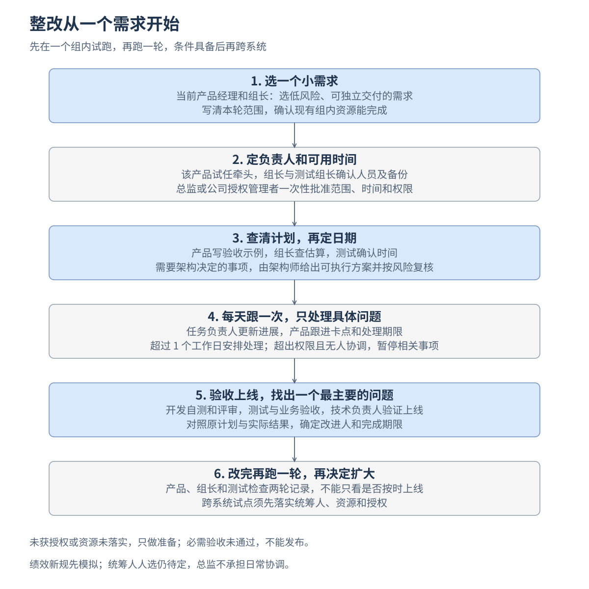

# 部门研发改进：从哪里开始

先在一个现有组内，把一个小需求从准备、开发到上线完整跑一遍。第一轮要做到：有人跟进、估算有人检查、问题有人处理、上线有人验收。

部门交付统筹人仍待定。先做已有组内资源能完成的单系统试点，获得小范围授权即可启动；新的跨系统承诺，要等统筹人、资源和权限落实。总监负责方向、一次性授权和重大审批。

## 按这六步开展

以下时间是建议安排，需求工期仍由团队检查后确定。

| 顺序 | 谁来做，具体做什么 | 做到什么再继续 |
|---|---|---|
| 1. 今天先选一个需求 | 当前产品经理和后端组长，从待办中选一个有业务价值、低风险、能独立验证和发布的小需求。建议选团队判断 1 至 2 周可完成的范围。 | 写清本轮做什么、暂不做什么；确认不用新增跨组配合。找不到就继续拆小，不先定上线日期。 |
| 2. 启动前，定人和时间 | 该产品经理试任交付负责人；组长、测试组长确认具体开发、测试、验收人及备份，并列出可用时间、需要减少的其他任务。由总监或公司有权审批的人一次性确认试点范围和授权。 | 名单、时间和权限已确认，产品愿意并有时间承担。无人能牵头或资源未落实，只做准备，不承诺交付日期。 |
| 3. 开工前，把计划查清 | 产品给正常和异常验收示例；开发拆任务、报工作量，组长检查依据；测试确认测试时间。涉及跨系统接口、数据迁移或其他高风险变化时，架构师给出决定，并按风险安排合格同行复核。 | 范围、估算、人员、测试和必要方案都确认后，才定日期。验收人也要写明检查结论，不能只填同意。 |
| 4. 开发期间，每天跟一次 | 任务负责人在现有任务表更新进展、下一步和卡点；产品检查，只找相关人解决问题，有必要时开约 10 分钟短会。 | 每个卡点都有处理人和期限。超过 1 个工作日，产品与组长在授权内减范围、改安排；超出权限且无人协调，就暂停受影响事项。临时插单必须说明替换什么、日期怎么变。 |
| 5. 上线时验收，上线后复盘 | 开发交自测和同行评审结果；测试完成关键场景、严重缺陷回归；业务方验收。系统技术负责人备好恢复方案，上线后验证核心业务。产品组织约 30 分钟复盘。 | 必要检查和严重质量问题未解决，不发布；上线未验证，不报完成。把原计划、实际日期、等待、返工和缺陷放在一起看，选一个最影响交付的问题，定改进人和期限。 |
| 6. 改完再跑一轮，再决定扩大 | 原班人员把上轮最主要的问题改掉，再跑一个小需求。产品、组长和测试检查两轮记录；跨系统试点由已到位的统筹人组织。 | 确认有人持续跟进、检查没有跳过、卡点能处理、上线有验证，才申请扩大。有问题就继续小范围改，不能仅凭按时上线判定成功。 |

## 第一轮只用现有任务表

不新增一套管理工具。每个任务保留这些信息：负责人、原定及实际日期、当前进展、卡点及处理人、验收结果链接。需求说明、自测、评审和发布记录直接链接已有材料；变更留下原因，原日期不覆盖。做事的人不能独自验收自己的工作。

第一轮只落实该需求所需的质量检查、验收人和发布控制，可先由指定人员按清单检查并留记录。部门级风险分级、全部流程自动化，在推广时逐项补齐；已有质量要求继续执行。

## 哪些事后面再做

- 试任两周时复核负责人是否适合：有能力差距先辅导、减负；明确要求并提供支持后仍反复未做到，再按记录调整职责。关键职责缺人期间，合格备份接手；无人能接就暂停相关事项。
- 跨系统试点前落实统筹人，再统一排优先级、解决共享人员冲突。单组试点成功，只说明组内能执行，不能证明跨组问题已解决。
- 绩效规则先用真实记录模拟一轮，试点记录不直接变成新规扣分或奖金调整。职责调整和评价办法见细则。
- 平台方向可在有独立人力时先访谈客户；规模改造等客户、技术和投入依据齐备后再决定。试点启动 60 天时复查交付和平台验证进展，再决定继续、调整或暂停。

## 现在就准备这一页

由当前产品经理和组长共同填好：需求名称、本轮范围、拟任交付负责人、参与及验收人员、每人可用时间和要减少的任务、做完怎么验证。提交的是这页具体试点安排，审批的是人、时间、范围和权限。

[职责、验收、绩效与人员调整细则](部门研发管理职责与验收细则.md)供执行时查阅。

先小范围试验、根据反馈再调整的做法，参考 [DORA 的小批量工作建议](https://dora.dev/capabilities/working-in-small-batches/)。上述人员和时间安排是针对本部门的试行建议。
