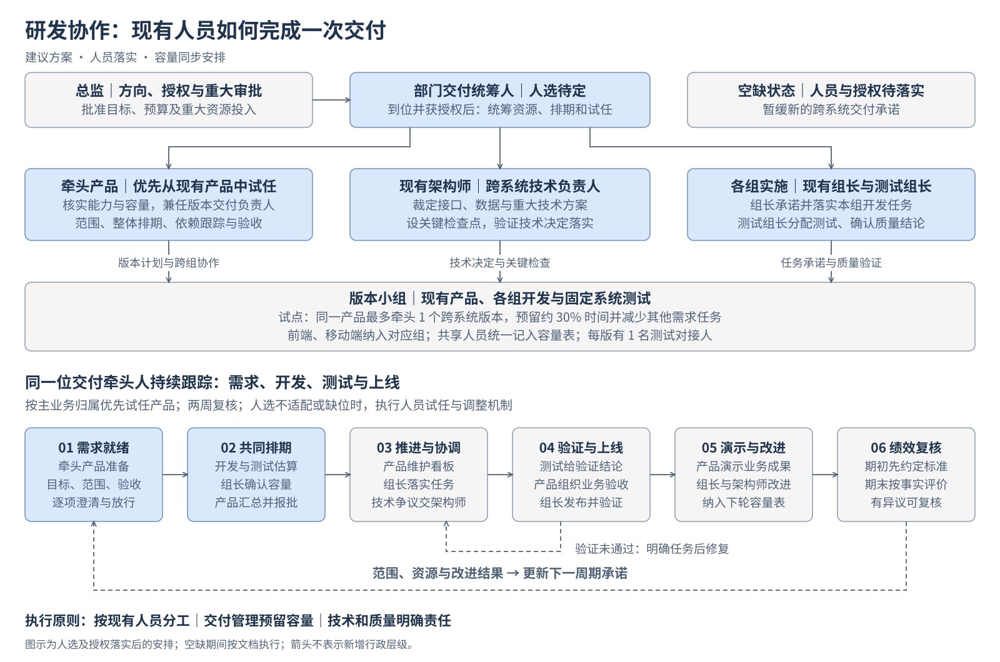
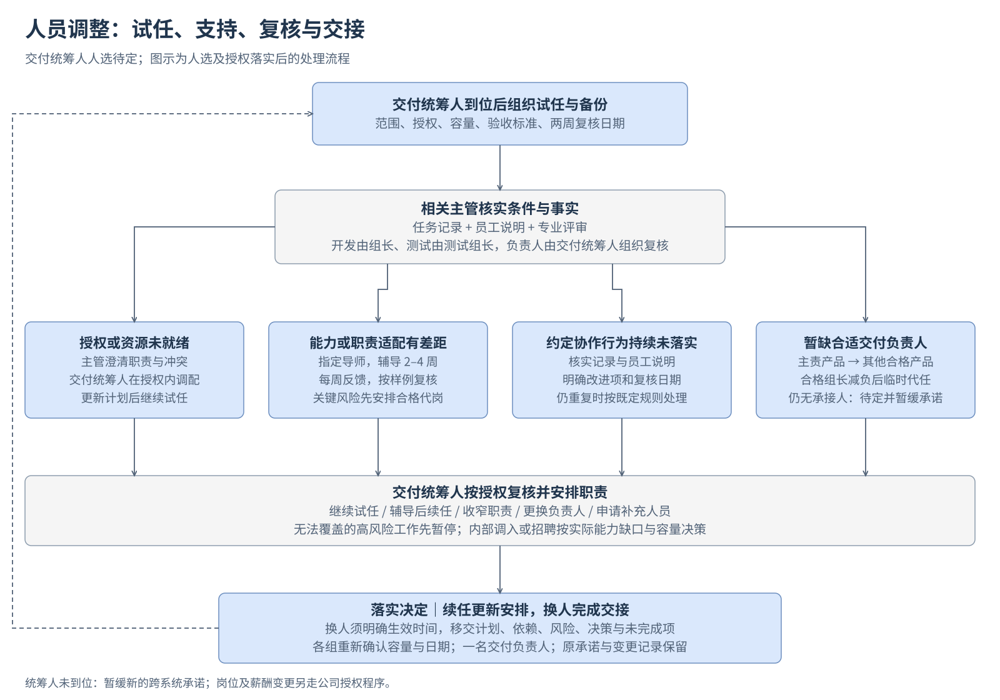

# 部门研发管理职责与验收细则

先按[启动方案](部门研发管理整改建议.md)完成单组试点，再按需要使用本细则。部门交付统筹人仍待定；跨系统试点须先落实人选、资源和授权，总监不承担日常补位。

单组试点先执行与该需求有关的估算检查、代码评审、自测、测试、业务验收和发布验证。所需架构检查仍须完成；部门级排期、岗位调整、绩效评分和平台改造按启动方案分阶段开展。工具配置与人工检查办法均需实际验证。

## 一、现有人员怎么分工，工作怎么验收

验收看工作能否使用，材料必须对应具体需求、任务、代码或版本；绩效评价见第五节。

| 谁来做 | 交什么、何时交 | 谁检查，怎样算通过 | 没做到怎么办 |
|---|---|---|---|
| 总监 | 试点或重大投入前，明确业务目标、预算范围、书面授权和重大事项决定。 | 统筹人确认目标、资源和权限能支持执行；重大决定由公司授权管理者复核。 | 新增任务未获授权或资源，不承诺交付；已授权工作继续。 |
| 部门交付统筹人：待定 | 排期前交优先级、人员可用时间和冲突处理方案；每周更新未解决事项及期限。 | 组长、测试确认可用时间，牵头产品确认范围；共享人员不能重复占用，依赖冲突已有解决办法。 | 不确认本轮交付日期，不再加入冲突任务。统筹人未履职，由公司另行指定的授权管理者复核，不默认交给总监。 |
| 各系统现有产品经理 | 送审前写清目标、范围、业务规则，给出正常和异常情况的验收示例。 | 业务方确认目标和规则；测试能写用例，组长能拆任务，涉及的接口边界清楚。 | 需求留在待澄清，不正式排期；已准备好的独立需求可先做。 |
| 版本交付负责人：优先由主责产品试任 | 承诺日期前交完整计划，确认所需配合；执行中更新风险、变更和处理人；上线后交结项记录。 | 统筹人查计划，参与组确认配合事项；结项记录要包含业务验收、测试结论和上线验证。 | 配合未确认，不承诺日期；风险记录过时，先更新或安排备份，期间不增加并行交付承诺；缺上线验证，不结项。 |
| 现有后端组长：兼系统实施负责人 | 排期前交任务拆分、估算依据、检查项及结论，列出开发、联调、修复时间和本组人员安排。 | 交付负责人查完整性，开发和测试确认任务、可用时间；高风险估算由架构师或合格同行抽查依据。 | 只填天数或写同意，不算检查完成；估算未查清，不纳入已承诺计划。 |
| 现有架构师：负责跨系统技术决策 | 需要架构检查的需求，排期前确定接口、数据归属、兼容和风险处理方案；关键功能完成后交检查结果。 | 参与组长确认方案能实施，测试验证约定风险，统筹人查决定是否落实；高风险方案另由合格技术同行复核。 | 方案缺失，依赖它的正式开发不能开始；关键风险未验证，不能关闭风险或发布相关功能。 |

开发到上线的分工：

| 谁来做 | 交什么、何时交 | 谁检查，怎样算通过 | 没做到怎么办 |
|---|---|---|---|
| 现有 6 名前端中指定 1 人：技术牵头 | 公共组件、共用交互或兼容规则变更时，交评审结论、实现和回归结果；每轮完成约定改进。 | 另一名前端查实现，相关测试查适用场景；改进要有实际使用和效果记录。 | 公共变更未通过，不合并；改进缺少结果，不结项。普通页面按原有标准和同行评审推进。 |
| 现有前后端、移动端开发 | 合并或提测前，交代码、自测结果、必要的自动检查结果和同行评审记录。 | 另一名合格开发查代码；测试对接人确认版本、范围和能否验证。 | 评审或必要检查未通过，不合并；版本、范围或自测记录不全，不接收提测。 |
| 现有测试组长及各系统固定测试 | 排期前确认测试人和测试时间；发布前交对应版本的测试结果、缺陷及回归结论。 | 测试组长查风险覆盖和结果，交付负责人查业务验收；组长亲自测试时，由另一名合格测试复核。 | 无可用测试时间，不承诺测试日期；关键流程未验证或严重缺陷未关闭，不允许发布。 |
| 现有系统技术负责人：执行发布 | 发布前交变更范围、回滚或恢复方案；发布后交监控和核心业务验证记录。 | 另一名合格技术人员先确认恢复方案能执行，测试和业务方各自给出结论；交付负责人根据上线结果结项。 | 恢复方案或必要结论缺失，不发布；上线验证未完成，不结项；异常按恢复方案处理。 |

跨系统试点前，架构师和测试组长共同写清风险等级、必测场景和发布条件。使用组确认能执行，统筹人组织验收，总监一次性批准相应权限。核心流程不可用、数据错误等问题必须解决，不能审批放行；这些标准未验收，不启动跨系统试点。前端牵头人由统筹人与架构师根据组件维护、评审经验选定，并减少其他任务。

每轮还要安排具体优化。架构师、前端牵头人和产品按获批的可用时间承诺成果：公共能力看使用组是否接入，业务优化看业务方确认的效果，技术债看约定的故障、返工、性能或维护成本是否改善。开会、写文档和签字不能代替结果。未完成要查原因，不能报完成，也不因此停掉无关交付。

## 二、没验收通过，就不能进入下一步

流程依次为：待澄清 → 可排期 → 已承诺／开发 → 可提测 → 可发布 → 已结项。每一步按第一节检查；代码合并还要通过同行评审和必要检查。

每条记录写清：事项、责任人、应交日期、材料链接及版本、验收人、检查项和结论。未通过时，再写原因、补救人和期限。

1. 验收人决定是否通过，并留下检查依据。做事的人不能独自验收自己的工作；兼任多个角色时，也要另找合格人员检查。空白、套话或版本不符的记录退回。
2. 统筹人与现有工具管理员配置状态修改权限、必填材料、代码合并保护，并关联检查结果和发布记录。工具暂不支持时，由指定验收人按清单修改状态，授权发布人检查发布单，统筹人抽查日志。配置或人工办法都要验证有效。
3. 跨系统接口、数据迁移、权限隔离、重大性能变化等需要架构检查。组长与测试在排期前确认检查项；不适用的要说明原因，不能由做事的人自行删掉。普通低风险变更按组内标准评审和验证。
4. 验收人缺席，可换合格人员，材料和检查不能省。一般遗留风险由有权接受的人签名确认，并定补救期限；严重质量问题不能豁免。只暂停受影响的事项。

评审和验证尽量随工作开展，配合自动检查，减少集中排队签字。参考 [DORA 的变更审批建议](https://dora.dev/capabilities/streamlining-change-approval/)。

## 三、组长和架构师的工作，具体查什么

开发报 5 天，组长要查任务范围、工作量、人员能投入多少时间、外部配合和测试时间，并说明为什么保留或调整估算。一个人还有其他任务，5 人日就不能直接当成 5 个工作日上线。交付负责人发现缺项，或同行抽查发现依据不成立，都要退回。每两周比较估算和实际，分别记录范围变化、等待时间和实现偏差，避免靠多报工期提高按期率。

架构师处理跨系统状态同步时，要明确状态归谁管、接口怎么定、重复请求和超时或回传失败怎么处理。组长据此开发，测试据此验证。只有意见、没有可执行方案，验收不通过；有方案但没有关键实现的验证结果，风险不能关闭。本轮没有这类需求，就检查已承诺的公共技术改进，不另加签字事项。长期没有相关工作，应按实际需要调整岗位投入和职责。

同样需要检查的还有：产品验收示例、统筹人的人员安排、交付负责人的配合确认、前端公共变更、开发自测与评审、测试记录、回滚准备、上线验证和优化效果。具体处理见第一节。

## 四、交付负责人由谁担任，缺人怎么办

单系统优先由当前产品经理试任；跨系统优先由负责最终业务验收的产品经理试任。联合版本没有主要业务归属时，统筹人从参与产品中按能力和可用时间选一人。

试点期，每名产品最多牵头 1 个跨系统版本，约留 30% 时间管理交付，相应减少其他任务，两轮后调整。组长负责本组实施，架构师负责技术决策，交付负责人从需求到上线跟完全程。

部门交付统筹人保持待定。公司确定人选、资源和授权后，由其处理跨版本取舍、日常会议和验收问题；缺岗或未履职，由公司指定的授权管理者处理，不默认由总监、架构师或组长兼任。

空缺期间，已有明确负责人和资源的工作、需求澄清及独立交付可继续；暂缓新的跨系统交付承诺。总监只负责方向、授权和重大审批。

## 五、工作卡住、绩效争议和人员调整怎么处理

工作卡住当天记录，超过 1 个工作日，统筹人安排补齐、合格人员代验或调整范围。责任人或验收人缺岗，启用事先指定的备份；无人能接，暂停相关事项并申请补人。不能逾期自动通过，也不能补签抹掉原记录。

每人期初约定 3 至 5 项成果、可用时间、权重和评分标准。期末看是否按时完成、验收是否通过、是否达到约定效果。提交、验收通过、效果得到验证要分开记录；效果还需观察，就标记待观察。

调分必须说明依据哪条规则、有哪些记录、本人能控制哪些因素。同一行为不重复扣分，合理异议、需求范围变化、资源不足分别处理。验收人漏查或无依据放行，也要检查其责任。评分争议交公司指定的独立复核人；新规则先模拟一轮，不直接调整奖金。

评价可看产品规则导致的返工、组长估算偏差的原因、架构风险处理和复用效果、前端公共功能的缺陷回归、测试关键场景覆盖和上线遗漏、统筹人解决冲突的时间。结合版本规模和任务难度判断，不直接按缺陷数或签字数排名。

| 查明的原因 | 怎么处理 |
|---|---|
| 资源、授权或优先级冲突 | 主管查清问题，统筹人在授权内减任务、调人员可用时间或改顺序，重新确认承诺。 |
| 能力不足或不适合当前职责 | 试任两周后复核；指定导师，建议辅导 2 至 4 周，每周反馈。高风险职责先由合格人员代岗；必要时保留专业工作，更换协调负责人。 |
| 条件已明确、支持已提供，约定行为仍反复未落实 | 结合任务记录和本人说明，按既定规则调整项目职责；必要时进入公司正式绩效或人事程序。 |
| 找不到合适的版本负责人 | 依次考虑主责产品、其他合格产品、减少编码任务后的合格组长临时代任。仍无人，保持待定，申请内部调入或招聘，暂缓该版本承诺。 |

换人时，统筹人确定生效时间，交接范围、计划、配合事项、风险、决策和未完成项。各组重新确认可用时间和日期，生效后只保留一名交付负责人。正式岗位、薪酬或劳动关系变更另走公司授权程序。明确预期、提供支持和持续反馈的原则，参考 [CIPD 的绩效管理说明](https://www.cipd.org/en/knowledge/factsheets/performance-factsheet/)。

## 六、推广与平台方向

启动顺序和推广条件见[启动方案](部门研发管理整改建议.md)。两轮试跑用于判断流程能否执行；60 天时结合交付和质量记录决定继续、调整或暂停，不因日期到了就扩大范围。

平台验证由负责拟对外销售核心业务的现有产品牵头，并减少同期任务。联合业务、销售访谈约 3 至 5 家潜在客户，查清目标客户、共性需求、付费意愿和实施支持成本。架构师提交最小可售方案、技术缺口和验证结果，业务方与使用组检查，统筹人汇总投入建议。客户和技术依据不足，不启动规模化平台改造；60 天内提出继续、调整或暂停的建议。
